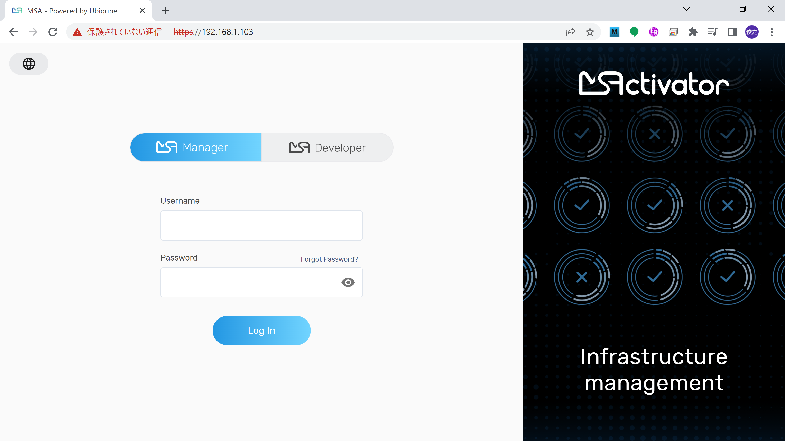
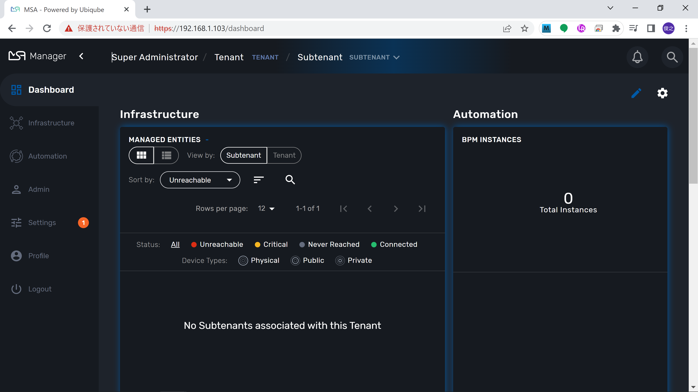
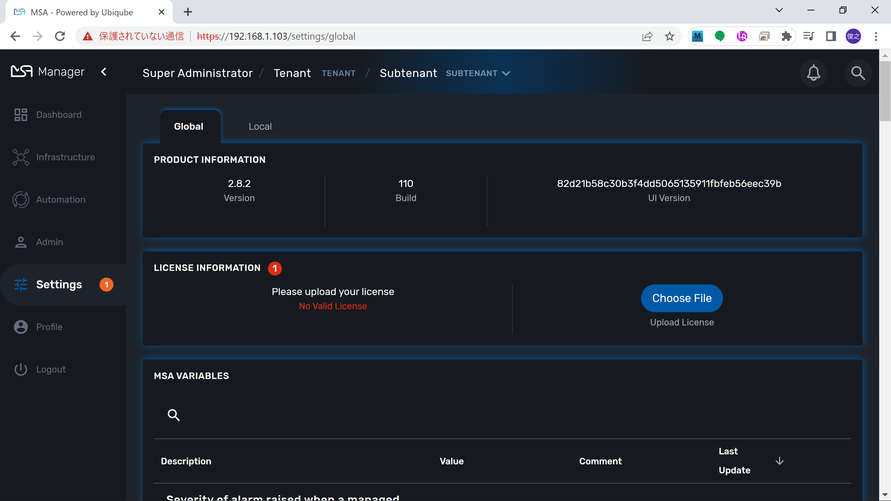
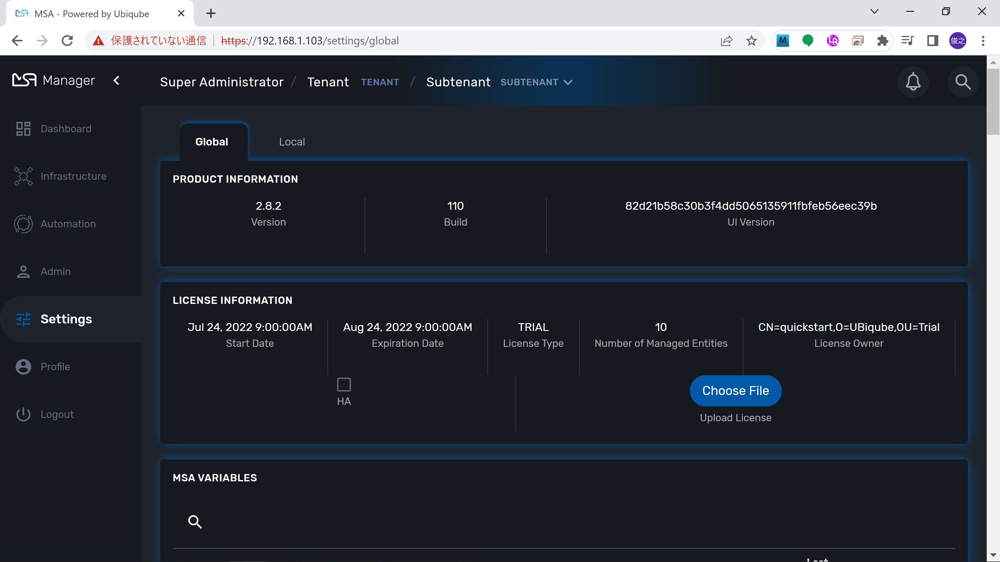
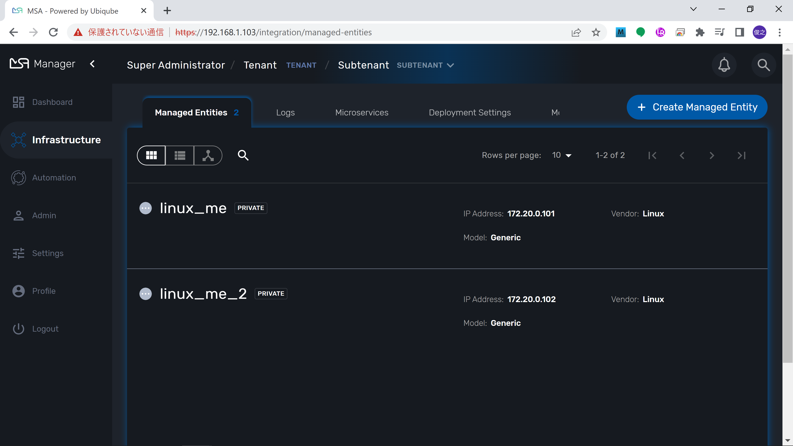

# MSA Installation
This section describe how to install MSA to CentOS 7.  

---
## contents：

* [Before you install](#before-you-install)
* [MSA install](#msa-install)
* [Apply license](#apply-license)
* [Create Managed Entity](#create-managed-entity)

---
## Before you install
Please install Docker Engine and Docker Compose before install MSA.
The documentation is [here](https://docs.docker.com/engine/install/centos/).  

---
## MSA install
Clone the github repository on you computer:

~~~
git clone https://github.com/ubiqube/quickstart.git
~~~

Change director, the last version of the MSActivator is available in the master branch:

~~~
cd quickstart
~~~

Use the install script to install the MSActivator. This script will start by installing the Docker images and configure the Docker containers.

~~~
./scripts/install.sh
~~~

---
## Apply license
You can get the license [here](https://ubiqube.com/start-your-trial/).  

Open MSA Web page from Web browser.  
Username:ncroot  
Password:ubiqube  

Click `Log In` button  

Click `Settings`  

Click `Choose File` button, and select downloaded licence file to upload.  

License applyed.

---
## Create Managed Entity
1. log in MSA server.
1. change directory to quick start
1. execute following command.

~~~
docker-compose exec msa-dev /usr/bin/create_mini_lab.sh
~~~

